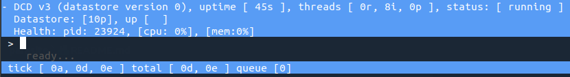
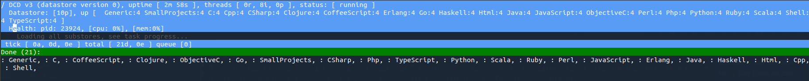
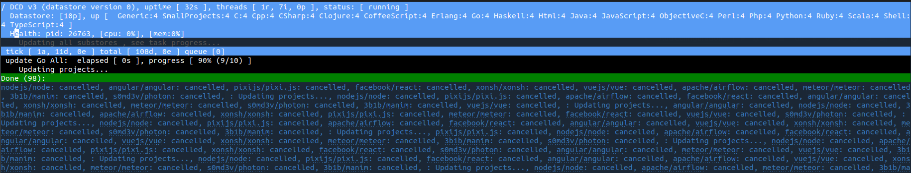

Parasite is a perpetual git & github scrapper that maintains a datastore of downloaded contents and continuously updates the items with new information as downloaded from the upstream sources. This repository consists of the updater application itself and a Rust library that can be used to read the datastore.  

# Setup

Rust must be installed in latest version. The following packages are required on Ubuntu, other systems will be similar. Only Linux is supported. 

    sudo apt-get install libssl-dev libgit2-dev cmake pkg-config libicu-dev zlib1g-dev libcurl4-gnutls-dev ruby-dev cloc
    gem install github-linguist    

To build, clone the repository and then run the following command:

    cargo build --release

Parasite's executable can then be found in `target/release`.

# Getting started

To create a basic dataset, first create a directory that will contain the data.

```
mkdir -p /data/djcode/example-dataset/
```

This can be anywhere on your disk, but be aware that datasets tend to be large.

Next, specify the list of repositories to include in the dataset:

```
parasite --datastore /data/djcode/example-dataset/ add https://github.com/nodejs/node.git
parasite --datastore /data/djcode/example-dataset/ add https://github.com/pixijs/pixi.js.git
parasite --datastore /data/djcode/example-dataset/ add https://github.com/angular/angular.git
parasite --datastore /data/djcode/example-dataset/ add https://github.com/apache/airflow.git
parasite --datastore /data/djcode/example-dataset/ add https://github.com/facebook/react.git
parasite --datastore /data/djcode/example-dataset/ add https://github.com/vuejs/vue.git
parasite --datastore /data/djcode/example-dataset/ add https://github.com/xonsh/xonsh.git
parasite --datastore /data/djcode/example-dataset/ add https://github.com/meteor/meteor.git
parasite --datastore /data/djcode/example-dataset/ add https://github.com/3b1b/manim.git
parasite --datastore /data/djcode/example-dataset/ add https://github.com/s0md3v/photon.git
```

Create a GitHub token file, eg:

`vim /data/djcode/ghtokens.csv`
 
 The contents of this file should be one column with the header `token` containing a list of GitHub OAuth tokens, 
 one on each line. For example:

    token
    fa56454....
    hj73647.... 
    
Parasite needs at least one token to work. You can generate a token for your GH account by following the instructions 
[here](https://docs.github.com/en/github/authenticating-to-github/creating-a-personal-access-token).

**Quickfix** To avoid an error later on, create a scratch space for cloning GH repos.  

```
mkdir -p /data/djcode/example-dataset/repo_clones
```

The next step is to enter *interactive* console in Parasite. Provide a path to the GitHub token file via the `ght` flag. You can also 
specify the number of threads that the downloader will use with the `n` flag (here we use 8).

```
parasite --datastore /data/djcode/example-dataset/ -ght /data/djcode/ghtokens.csv -n 8 --interactive  
```



In *interactive* console: execute the `loadall` command to load substore information into memory.

```
 > loadall 
```



Then, also in *interactive* console: execute `updateall` to start the downloader. This will cause parasite to download, 
process and store information about each added repository using 8 threads.

```
 > updateall
```



Wait until the download completes (about 15 minutes for the example dataset). Exit the downloader (`^C`). The example 
dataset is ready for querying. 

# Usage

Parasite can be executed using the `parasite` command and expects the following arguments:

    parasite [GLOBAL_ARGS] [COMMAND COMMAND_ARGS]

The following global arguments are supported

### `--datastore` or `-ds`

Specifies the root for the datastore parasite should operate on. Defaults to current directory. If the provided path does not exist, it will be created and a new empty datastore will be ininitialized. 

### `-ght` or `--github-tokens`

Specifies path to a file containing github access tokens. If not specified, assumes `github-tokens.csv` in current directory. The file is expected to be a CSV file with one column and header row, such as:

    token
    fa56454....
    hj73647....

### `--num-threads` or `-n`

The number of threads parasite can use. For the updater this means the number of simultaneous project updates. Defaults to 16.

### `--verbose` or `-v`

Displays verbose information about the tasks executed. 

### `--interactive` or `-i`

Launches parasite in interactive mode that allows real-time interaction and monitoring of the performed tasks. For more information about the interactive mode, see the appropriate section below. 

The command is either the the command to be executed on the command line mode (details below), or the first command to be executed in the interactive mode. If empty, `size` command will be executed in command-line mode while the interactive mode will do nothing and wait for a command to be entered interactively. 

Example:

    parasite -ds /mnt/data/datastore -gh /home/peta/tokens.csv -v summary

## CLI Mode

The following commands can be executed:

> Other comannds that we used at some point but are not deemed too useful are listed in appendix A. 

### `size`

Displays the size of the dataset in bytes. The size is given per recorded entities (projects, commits, contents, etc.) and a total. Size is split between the mandatory contents files and the index files, which can be deleted and regenerated. 

### `summary`

Displays the summary of the datastore that prints the number of stored entities in all substores without any deduplication being performed. 

### `savepoints`

Lists the information about all available savepoints in the datastore.

### `add` url_or_csv

Adds project with given url to the datastore, or if instead of url, local csv file is given, analyzes the columns of the file for git urls and if found, adds all projects from the file to the datastore. When adding the projects, checks for duplicates. Note that the projects are only added to the datastore, but not actually updated. 

> This command is also available in the interactive mode.

### `create-savepoint` name

Creates savepoint of given name from current state of the datastore. 

> This command is also available in the interactive mode.

### `revert-to-savepoint` name

Reverts the datastore to given savepoint. 

> NOTE: This is dangerous. Once the datastore is reverted, all extra data is lost. Not available in interactive mode.

### `update-project` name [--force]

Updates given project, possibly forcefully. Loads the required substore mappings as needed. The project name is matched in the same way as `show-project`.  

### `active-projects` [days = 90]

Displays a large csv that displays per substore and total number of projects, valid projects and active projects. Project is considered active if it has at least one commit no older than `days` before now.

## Interactive Mode


# Library

> TODO some basic information about how to use the library and stuff. Will be written once it is actually used in other crates.

## API Usage

The API provides various view wrappers around the internal parasite objects. These are all defined in the `lib.rs` file. Notably these are `DatastoreView` and `SubstoreView` for the whole datastore and its substores respectively. The datastore provides information about projects, savepoints and substores, while the substores provide wrappers around everything else. These wrappers (`StoreView`, `LinkedStoreView`, etc.) then wrap around actual database records, one file each and provide iterators to its elements. 

> To see the actual use, have a look at the `example_` prefixed commands in `main.rs` and definitely at `lib.rs`, which actually provides all the API.

# Appendix A - TODO

> The following are current items that are being worked on or that must be checked are already finished:

- convert iterators in the db.rs to the new format

- add metadata extraction for the assembled projects ? 

- and how to stop them threads that are updating (purge the queue should do it, the task would then end once all other threads will become idle)
- add log for commands entered
- add log for on/off of the downloader on the database

> And the following are large items that should be added to parasite:

- github linguist and cloc to be executed on snapshots
- db guys should be able to regenerate their indices from the datafiles
- add projects from github directly
- add issues


# Appendix B - Debug CLI Commands

### `contents-compression`

Calculates and displays the compression ratio for contents. This takes some time as all substore's contents are walked, read and decompressed to analyze the decompressed size. Compressed and decompressed data size is reported for each substore and a total. The sizes already take into account the overhead of the storage format (id and compressed size). 

# Appendix D - Version History

The datastore keeps its own version counter, which signifies the internal version of the datastore. The versions described here are binary incompatible versions of parasite, stored here only for historic purposes and context:

### 0.3 (current)

Substores and various fixes to API and storage model. Complete code rewrite. 

### 0.2.1

File contents are stored in a split store, split by file extension.

### 0.2 

File contents are stored as well, interactive updater. Binary format only. Only git and github input sources. Pretty much complete code rewrite.

### 0.1

csv format, no file contents stored. Multiple data inputs (git, github, ghtorrent).
